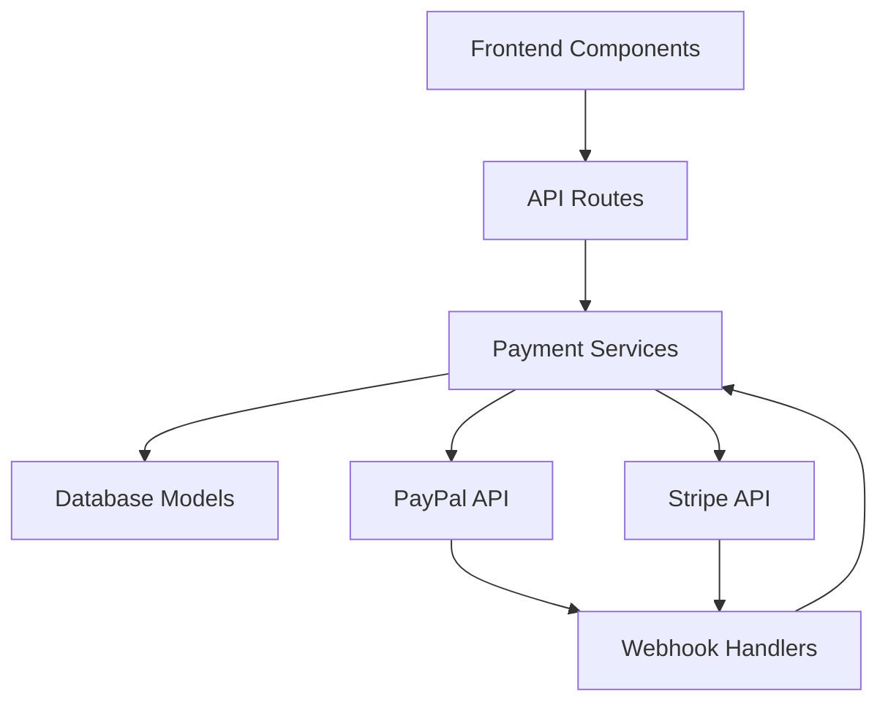

# Payment Gateway Design

## Architecture Overview

The payment gateway feature will be implemented as a modular component within the memory assistant application, following a service-oriented architecture. The system will integrate with third-party payment providers (Stripe and PayPal) to handle payment processing while maintaining PCI compliance by never storing sensitive payment information in our database.

The architecture consists of the following layers:

1. **Frontend Layer**: React components for payment forms, subscription management, and payment history
2. **API Layer**: Next.js API routes for payment processing, subscription management, and webhook handling
3. **Service Layer**: Business logic for payment operations, subscription management, and webhook processing
4. **Data Layer**: Prisma models for storing payment and subscription data
5. **Integration Layer**: Interfaces with third-party payment providers (Stripe and PayPal)



## Technology Stack

### Frontend
- **React 19.1.0**: Main UI framework
- **Next.js 15.5.3**: Full-stack framework with API routes
- **Tailwind CSS**: Styling framework
- **Radix UI**: Component library for form elements and dialogs
- **React Hook Form**: Form handling with validation
- **Zod**: Schema validation
- **Stripe React Components**: For secure credit card input
- **PayPal JS SDK**: For PayPal integration

### Backend
- **Next.js API Routes**: Serverless API endpoints
- **Prisma**: Database ORM
- **PostgreSQL**: Primary database
- **Stripe Node.js SDK**: Credit card processing and subscription management
- **PayPal Node.js SDK**: PayPal integration
- **NextAuth.js**: Authentication and session management
- **Zod**: Request/response validation

### Database
- **PostgreSQL**: Primary database for storing payment and subscription data
- **Prisma**: ORM for database operations

### Third-party Services
- **Stripe**: Credit card processing and subscription management
- **PayPal**: Alternative payment method
- **NextAuth.js**: Authentication provider

## Data Models

### Payment Model
```prisma
model Payment {
  id              String            @id @default(cuid())
  userId          String
  amount          Int               // Amount in cents
  currency        String            @default("USD")
  status          PaymentStatus     @default(PENDING)
  paymentMethod   PaymentMethod
  provider        PaymentProvider
  providerId      String?           // ID from payment provider
  description     String?
  metadata        Json?
  createdAt       DateTime          @default(now())
  updatedAt       DateTime          @updatedAt
  
  // Relations
  user            User              @relation(fields: [userId], references: [id], onDelete: Cascade)
  subscription    Subscription?     @relation("SubscriptionPayment")
  refund          Refund?
  
  @@map("payments")
}
```

### Subscription Model
```prisma
model Subscription {
  id              String              @id @default(cuid())
  userId          String
  planId          String
  status          SubscriptionStatus  @default(ACTIVE)
  currentPeriodStart DateTime         @default(now())
  currentPeriodEnd   DateTime
  cancelAtPeriodEnd Boolean           @default(false)
  provider        SubscriptionProvider
  providerId      String?             // ID from subscription provider
  metadata        Json?
  createdAt       DateTime            @default(now())
  updatedAt       DateTime            @updatedAt
  
  // Relations
  user            User                @relation(fields: [userId], references: [id], onDelete: Cascade)
  payments        Payment[]           @relation("SubscriptionPayment")
  
  @@map("subscriptions")
}
```

### SubscriptionPlan Model
```prisma
model SubscriptionPlan {
  id              String              @id @default(cuid())
  name            String
  description     String?
  price           Int                 // Price in cents
  currency        String              @default("USD")
  interval        SubscriptionInterval
  intervalCount   Int                 @default(1)
  features        Json                // List of features
  isActive        Boolean             @default(true)
  metadata        Json?
  createdAt       DateTime            @default(now())
  updatedAt       DateTime            @updatedAt
  
  @@map("subscription_plans")
}
```

### Refund Model
```prisma
model Refund {
  id              String            @id @default(cuid())
  paymentId       String
  amount          Int               // Amount in cents
  reason          String?
  status          RefundStatus      @default(PENDING)
  provider        PaymentProvider
  providerId      String?           // ID from payment provider
  metadata        Json?
  createdAt       DateTime          @default(now())
  updatedAt       DateTime          @updatedAt
  
  // Relations
  payment         Payment            @relation(fields: [paymentId], references: [id], onDelete: Cascade)
  
  @@map("refunds")
}
```

### Enums
```prisma
enum PaymentStatus {
  PENDING
  SUCCEEDED
  FAILED
  CANCELED
  REFUNDED
  PARTIALLY_REFUNDED
}

enum PaymentMethod {
  CREDIT_CARD
  PAYPAL
}

enum PaymentProvider {
  STRIPE
  PAYPAL
}

enum SubscriptionStatus {
  ACTIVE
  CANCELED
  EXPIRED
  PAST_DUE
  UNPAID
}

enum SubscriptionProvider {
  STRIPE
  PAYPAL
}

enum SubscriptionInterval {
  DAY
  WEEK
  MONTH
  YEAR
}

enum RefundStatus {
  PENDING
  SUCCEEDED
  FAILED
  CANCELED
}
```

## API Design

### Payment Endpoints

#### Create Payment Intent
- **Method:** POST
- **Path:** /api/payments/create-intent
- **Description:** Creates a payment intent for credit card processing
- **Authentication:** Required (JWT)
- **Request:**
  ```json
  {
    "amount": 1000,
    "currency": "USD",
    "paymentMethod": "CREDIT_CARD",
    "description": "Premium subscription"
  }
  ```
- **Response:**
  ```json
  {
    "clientSecret": "pi_123456_secret_789012",
    "paymentIntentId": "pi_123456"
  }
  ```

#### Create PayPal Order
- **Method:** POST
- **Path:** /api/payments/create-paypal-order
- **Description:** Creates a PayPal order for payment
- **Authentication:** Required (JWT)
- **Request:**
  ```json
  {
    "amount": 1000,
    "currency": "USD",
    "description": "Premium subscription"
  }
  ```
- **Response:**
  ```json
  {
    "orderId": "paypal_order_id_123456",
    "approvalUrl": "https://www.paypal.com/checkoutnow?token=paypal_order_id_123456"
  }
  ```

#### Capture PayPal Payment
- **Method:** POST
- **Path:** /api/payments/capture-paypal-payment
- **Description:** Captures a PayPal payment after user approval
- **Authentication:** Required (JWT)
- **Request:**
  ```json
  {
    "orderId": "paypal_order_id_123456"
  }
  ```
- **Response:**
  ```json
  {
    "paymentId": "pay_123456",
    "status": "SUCCEEDED"
  }
  ```

#### Get Payment History
- **Method:** GET
- **Path:** /api/payments/history
- **Description:** Retrieves payment history for the authenticated user
- **Authentication:** Required (JWT)
- **Request:** None
- **Response:**
  ```json
  {
    "payments": [
      {
        "id": "pay_123456",
        "amount": 1000,
        "currency": "USD",
        "status": "SUCCEEDED",
        "paymentMethod": "CREDIT_CARD",
        "description": "Premium subscription",
        "createdAt": "2023-01-01T00:00:00Z"
      }
    ]
  }
  ```

### Subscription Endpoints

#### Create Subscription
- **Method:** POST
- **Path:** /api/subscriptions/create
- **Description:** Creates a new subscription
- **Authentication:** Required (JWT)
- **Request:**
  ```json
  {
    "planId": "plan_monthly_premium",
    "paymentMethod": "CREDIT_CARD"
  }
  ```
- **Response:**
  ```json
  {
    "subscriptionId": "sub_123456",
    "clientSecret": "secret_789012",
    "status": "ACTIVE"
  }
  ```

#### Update Subscription
- **Method:** PUT
- **Path:** /api/subscriptions/update
- **Description:** Updates an existing subscription (plan change)
- **Authentication:** Required (JWT)
- **Request:**
  ```json
  {
    "subscriptionId": "sub_123456",
    "newPlanId": "plan_yearly_premium"
  }
  ```
- **Response:**
  ```json
  {
    "subscriptionId": "sub_123456",
    "status": "ACTIVE",
    "currentPeriodEnd": "2024-01-01T00:00:00Z"
  }
  ```

#### Cancel Subscription
- **Method:** DELETE
- **Path:** /api/subscriptions/cancel
- **Description:** Cancels a subscription
- **Authentication:** Required (JWT)
- **Request:**
  ```json
  {
    "subscriptionId": "sub_123456",
    "immediately": false
  }
  ```
- **Response:**
  ```json
  {
    "subscriptionId": "sub_123456",
    "status": "CANCELED",
    "cancelAtPeriodEnd": true
  }
  ```

#### Get Subscription Status
- **Method:** GET
- **Path:** /api/subscriptions/status
- **Description:** Retrieves subscription status for the authenticated user
- **Authentication:** Required (JWT)
- **Request:** None
- **Response:**
  ```json
  {
    "subscription": {
      "id": "sub_123456",
      "status": "ACTIVE",
      "planId": "plan_monthly_premium",
      "currentPeriodStart": "2023-01-01T00:00:00Z",
      "currentPeriodEnd": "2024-01-01T00:00:00Z",
      "cancelAtPeriodEnd": false
    }
  }
  ```

### Webhook Endpoints

#### Stripe Webhook
- **Method:** POST
- **Path:** /api/webhooks/stripe
- **Description:** Handles webhook events from Stripe
- **Authentication:** Signature verification
- **Request:** Stripe event payload
- **Response:** HTTP 200 OK

#### PayPal Webhook
- **Method:** POST
- **Path:** /api/webhooks/paypal
- **Description:** Handles webhook events from PayPal
- **Authentication:** Signature verification
- **Request:** PayPal event payload
- **Response:** HTTP 200 OK

## UI/UX Design

### Payment Form Screen
A secure payment form for credit card processing using Stripe Elements:
- Card number input with real-time validation
- Expiration date input
- CVC input
- Billing address fields (optional)
- Submit payment button
- Error message display area

### PayPal Payment Screen
A screen for PayPal payment processing:
- PayPal button integration
- Order summary display
- Return to application after payment completion
- Error handling for failed payments

### Subscription Management Screen
A dashboard for managing subscriptions:
- Current subscription status display
- Plan upgrade/downgrade options
- Cancel subscription option
- Payment method update
- Billing history access

### Payment History Screen
A view of past payments:
- Table showing payment date, amount, status, and description
- Filter options by date range and status
- Pagination for large datasets
- Download receipt option

## Security Considerations

### Authentication & Authorization
- All payment-related API endpoints require JWT authentication
- Role-based access control for administrative functions
- Session management with secure token handling

### Data Protection
- No storage of sensitive payment information (PCI compliance)
- Encryption of all data in transit using TLS
- Secure storage of API keys and secrets using environment variables
- Regular security audits and penetration testing

### Payment Security
- Use of Stripe Elements for secure credit card input
- PayPal's secure payment processing
- Webhook signature verification
- Fraud detection using provider's built-in tools
- 3D Secure authentication for credit cards when required

## Error Handling

### Error Types
- **Payment Validation Errors:** Invalid card details, insufficient funds
- **Payment Processing Errors:** Network issues, provider downtime
- **Subscription Errors:** Plan changes not allowed, cancellation restrictions
- **Webhook Errors:** Invalid signatures, malformed payloads

### User Feedback
- Clear error messages in the user's language
- Guidance on how to resolve common issues
- Contact support options for unresolved problems
- Retry mechanisms for transient failures

## Performance Considerations

### Response Times
- Payment intent creation: < 2 seconds
- PayPal order creation: < 3 seconds
- Payment history retrieval: < 1 second (for typical user history)
- Webhook processing: < 500ms

### Scalability
- Horizontal scaling of API routes using Next.js serverless functions
- Database connection pooling with Prisma
- Caching of frequently accessed data (subscription plans, user status)
- Queue-based processing for webhook events to handle spikes

## Integration Points

### Integration 1: User Authentication System
Integration with the existing NextAuth.js authentication system to:
- Associate payments with user accounts
- Manage user sessions for payment flows
- Control access to premium features based on subscription status

### Integration 2: Database Schema
Extension of the existing Prisma schema to include:
- Payment records
- Subscription data
- Refund information
- Related enums and relationships

### Integration 3: Notification System
Integration with the existing notification system to:
- Alert users of payment successes and failures
- Notify users of subscription changes
- Send billing reminders and receipts

### Integration 4: Gamification System
Integration with the existing gamification system to:
- Award points for subscription purchases
- Unlock achievements related to premium features
- Track premium feature usage for analytics

## Testing Strategy

### Unit Tests
- Payment service functions
- Subscription management logic
- Webhook event processing
- Data validation and transformation

### Integration Tests
- Payment provider API integration
- Database operations for payment data
- Authentication and authorization
- Error handling scenarios

### End-to-End Tests
- Complete payment flow from UI to database
- Subscription lifecycle management
- Webhook processing and system response
- User access to premium features after payment

## Deployment Strategy

### Environment Setup
- Development environment with test keys from Stripe and PayPal
- Staging environment for pre-production testing
- Production environment with live payment processing
- Environment-specific configuration for API keys and endpoints

### Rollout Plan
- Initial rollout to a small group of beta users
- Monitoring of payment success rates and error rates
- Gradual expansion to all users
- Continuous monitoring and optimization

## Monitoring & Logging

### Key Metrics
- Payment success rate
- Payment failure rate by reason
- Subscription conversion rate
- Churn rate
- Average revenue per user
- Webhook processing success rate

### Logging Strategy
- Detailed logging of all payment operations
- Webhook event logging with full payloads
- Error logging with stack traces
- Audit trail for all subscription changes
- Performance metrics for payment processing times